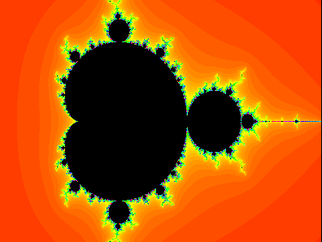

Try 'nrc MapMandelbrotSet MapJuliaSet Chaos UnivViewPort ViewPort ViewFrame'  
then 'java MapMandelbrotSet' and explore.

The interface is minimal:  
- click mouse to move zoom frame    
- '+' or '-' to resize zoom frame, or drag mouse    
- press Enter or double-click to zoom   
- 'calculate' takes # iterations and left, right, top, bottom 
(and real, imaginary numbers, boundary for Julia sets)
 and calculates   
- 'animate' cycles through colours
- 'flip' flips between Mandelbrot set and Julia set
- resize window for more detail

Ctrl-C to quit

Code is loosely based on 'Dynamical systems and fractals' by 
Karl-Heinz Becker and Michael Dörfler.

The real mathematician will notice complex geometry is too complex for me,
even though I've been pursuing this exploration since Zilog Z80 times. 
It took a lot more time then;

The code however may illustrate how easy Swing components and other Java features
are manipulated in NetRexx.

And you'll encounter amazing images.

Marc Remes  
remesm@gmail.com

